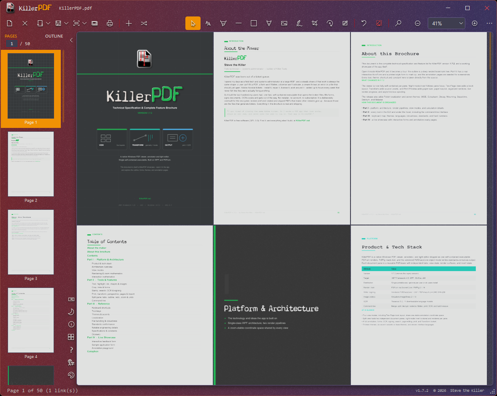
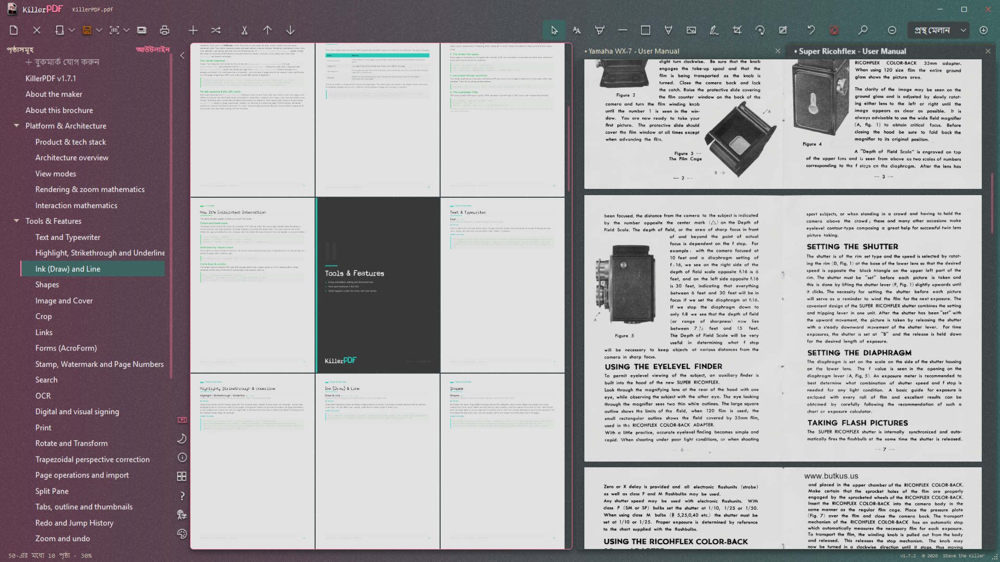
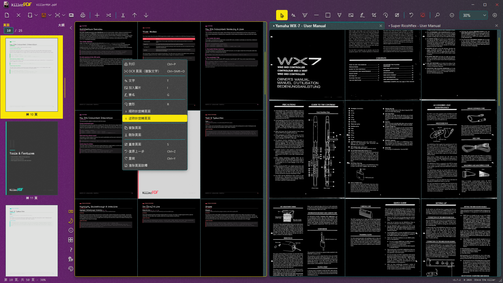
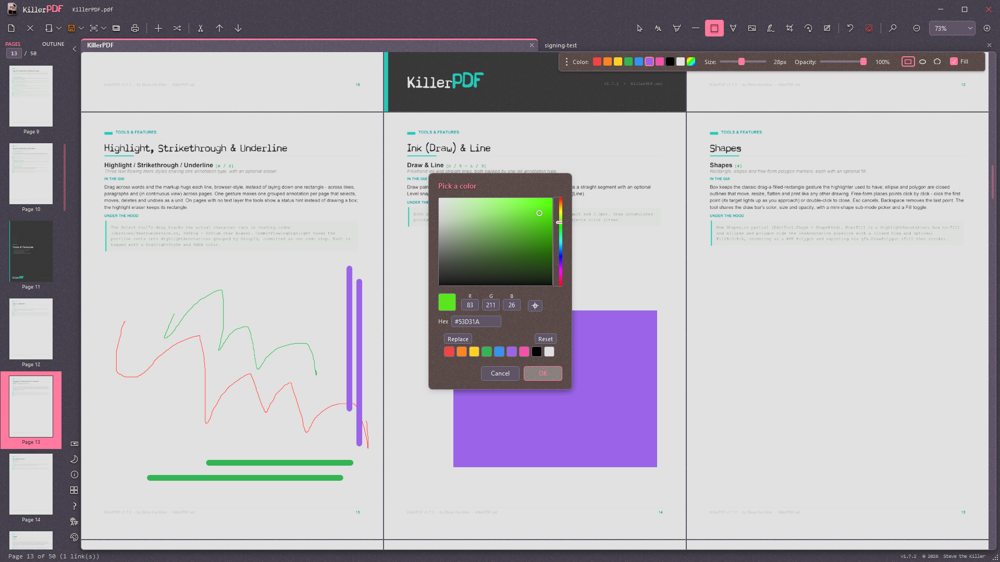

<p align="center">
  <a href="https://killerpdf.net"></a>
</p>

Free and open-source PDF editor for Windows. View, annotate, OCR, merge, split, edit text, draw, sign, fill forms, print, flatten, and open password-protected PDFs without an Adobe subscription or a phone-home. Install or run portable. Single Windows EXE, ~16 MB, no runtime install required.

Full how-tos live on the [help page](https://killerpdf.net/help.html); internals, formats, and limits on the [technical page](https://killerpdf.net/technical.html).

## Features

- High-quality PDFium rendering with four view modes (Single, Continuous, Two-Page with a book layout option, Grid), tabbed documents, and a split pane for two documents side by side
- Annotate: inline text editing with font matching, word-wrapping text boxes, draw, lines, highlights (saved with the Multiply blend so text underneath stays readable), images, and page-number / watermark stamps - all with per-tab undo and redo
- Built-in OCR (Tesseract bundled, no cloud): make searchable PDFs, OCR a page or region to the clipboard, extract all text; extra languages download on demand
- Organize pages: merge, split, insert, rotate, crop, extract, delete, drag-and-drop reordering; drop a folder or `.zip` onto the window to merge its contents
- Transform: rotate, scale, flip, deskew by drawing a level line, perspective correction for photographed pages, and a LEVELS section (black point, white point, midtones) for pale scans
- Forms: fill text, checkbox, radio, and comb fields as live controls and save back; digital signatures with a cloud certificate (Certum SimplySign), plus drawn or imported signatures and initials
- Print with a real in-app preview, paper size and source selection, scale / position / margins / pages-per-sheet options at 300 DPI; Save Flattened rasterizes to a fully uneditable PDF
- Full-text search with highlighting, and column-aware text selection that copies multi-column pages in reading order
- Night-mode invert (per pane in split view), thirteen themes - four of them (Dark, Light, Black and 98SE) with six live accent colors each, 33 looks in all - toolbar styles, and a resizable sidebar that docks left or right
- Localized UI in 11 languages (contribute via `TRANSLATING.md`); full keyboard shortcut overlay on F1 with list and visual keyboard views
- Opens password-protected PDFs (prompts instead of erroring) and repairs damaged ones
- Runs portable, or self-installs per-user (no UAC) or machine-wide (`/silent` for scripted deployment); registers as a PDF handler and uninstalls cleanly
- Standards-safe saves: every release is validated with veraPDF across a 2,900-file conformance corpus with a zero-regressions bar - see [validation/RESULTS.md](validation/RESULTS.md)
- Local-only: no account, no telemetry, no phone-home

## Command line

Every core operation also runs headless from a terminal, with meaningful exit codes, even while the app is open:

```powershell
KillerPDF.exe --merge out.pdf a.pdf b.pdf scan.jpg
KillerPDF.exe --extract-pages in.pdf 1-3,5 out.pdf
KillerPDF.exe --split in.pdf pages\
KillerPDF.exe --decrypt locked.pdf open.pdf [--password p]
KillerPDF.exe --to-image in.pdf imgs\ --dpi 300 --format jpg
KillerPDF.exe --flatten in.pdf flat.pdf
KillerPDF.exe --print in.pdf --printer "HP LaserJet" --pages 1-4 --copies 2
KillerPDF.exe --ocr scan.pdf searchable.pdf --lang eng
KillerPDF.exe --batch-resave inDir\ outDir\ --log report.csv
KillerPDF.exe --help
```

Full reference on the [help page](https://killerpdf.net/help.html).

## Screenshots

| | |
| --- | --- |
| <br>**Grid view** — Scan a whole document at once while thumbnails and navigation stay close at hand. | <br>**Split panes and outlines** — Browse two independent documents side by side, with tabs, pages, zoom, and navigation kept per pane. |
| <br>**Night mode and localization** — Per-pane inversion, themed context menus, and an interface translated into eleven languages. | <br>**Annotation tools** — Draw, highlight, add shapes, and choose exact colors without leaving the document. |

## Requirements

- Windows 10 or 11 (x64)
- No runtime install. Everything needed is inside the EXE (targets .NET Framework 4.8, which ships with every supported Windows release).

## Download

WinGet:

```powershell
winget install killerpdf
```

Chocolately:

```powershell
choco install killerpdf
```

- Prebuilt binary: <https://github.com/SteveTheKiller/KillerPDF/releases/latest/download/KillerPDF.exe>
- Source (GPL3 corresponding source for this release): <https://github.com/SteveTheKiller/KillerPDF/releases/download/v1.7.3/KillerPDF-1.7.3-src.zip>

## Build from source

```powershell
git clone https://github.com/SteveTheKiller/KillerPDF.git
cd KillerPDF
dotnet publish -c Release
```

Output lands in `bin/Release/net48/publish/`. The publish step produces a single Costura-bundled `KillerPDF.exe` plus a versioned `KillerPDF-<version>-src.zip` for GPL3 source distribution.

Requires the .NET 8 SDK or later to build (even though the output targets .NET Framework 4.8).

The PDF write engine (PdfSharpCore, MIT) is vendored under `third_party/PdfSharpCore/` and builds as part of the solution; it carries six standards-conformance patches, each marked `KillerPDF patch` in the source. Origin commit and details are recorded in `third_party/PdfSharpCore/VENDORED.txt`.

## Translations

UI strings live in `Strings/` (one XAML `ResourceDictionary` per locale). To add or improve a language, see [TRANSLATING.md](TRANSLATING.md). Missing keys fall back to English, so a partial translation is fine.

## Changelog

See [CHANGELOG.md](CHANGELOG.md).

## License

GPLv3. See [LICENSE](LICENSE). If you fork, modify, or redistribute KillerPDF, your version must also be released under GPLv3 with source available. No exceptions for commercial rebrands.
